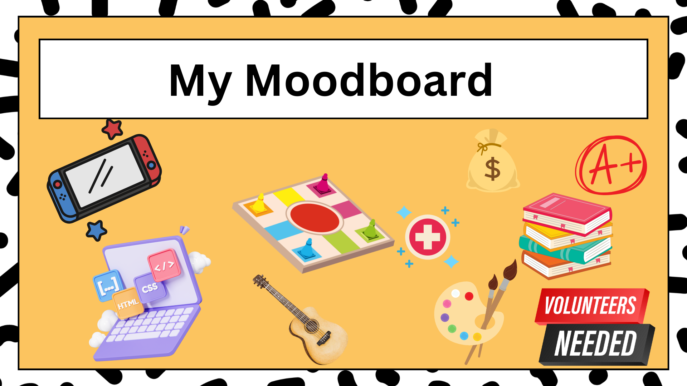

# Me in Markdown

## Introduction

Hello, my Name is Hovanes. I am in 10th grade and also 15 years old. Some of my hobbies are playing video games and reading thrillers. One of my favorite book series is the Harry Potter books. Recently I have tried to code a game in lua for roblox. 
One personal milestone I have is getting all A's for 4 years. One fun fact about myself is I like to play board games. My Goal for this year is to get all A's and pass my AP Tests with at least a 4. A place I went to over the summer was Vancouver, Canda and went and explored around the area. Some of my favorite food over the summer was Pizza because it hits different over the summer. 
I hope to achive a A in this class and get at least a 4 on the AP test. One of the most memorable experiances I had this summer was hanging out with my cousins on my birthday. Over the summer I attempted to build a game using Lua on roblox studios. I did not really participate in sports over the summer but I did swim in my pool when it got hot. Some creative endeavors I did over the summer was reading books and drawing. I did work at the library for volunteer hours over the summer.
 I do not really have any family traditions that I did over the summer but I did have a lot of family birthdays. A favorite summer memory with a friend I had was when I was playing a game with him. So a future career I want to pursue is becoming something in a medical field so the actions I am taking clubs like Red Cross to help acheive.  

## My PlayList

[This is my spotify playlist!]()

## Collage / Moodboard

